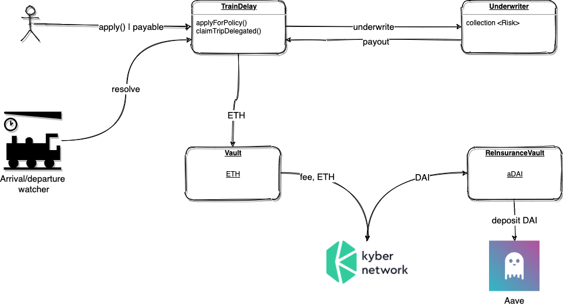

# [Terminal](https://terminal.insure/) &middot; 

Open source implementation of the Terminal Delay Protection protocol. Version 0.1

Available live: https://terminal.insure

## Description
Terminal is a protocol for protecting the railway trips again the delay and cancellation. \
Acting similar to the 'traditional' insurance, Terminal's benefits are transparency, low fees and inclusion. 

## Architecture
High level overview of the core components:

## License

The Terminal Delay Protection is under [the AGPL v3 license](LICENSE.md)
